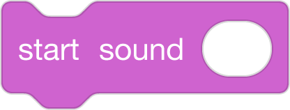

# Scaffolding Techniques: Activity With Solution (ELA/CS Integration)
#### by Block 19
Roster: Alana Robinson, Ashley Ufret, Shana Elizabeth Henry, Qianhui Vanessa Zou

Programming Language:  Scratch

Scaffold: Storyboard, UDL

Activity: Use code to describe the pattern/loop in the text Goldilocks and the Three Bears.](Activity: Students will learn how a pattern in a story is connected to a loop in CS. They will use block based code to describe the pattern/loop in the text Goldilocks and the Three Bears.)

Lesson Resources:

Printable (Text Only) Version: https://www.dltk-teach.com/rhymes/pgoldilocks_story.asp 

Video Version Read-Aloud: https://www.dltk-teach.com/rhymes/pgoldilocks_story.asp

UDL/Differentiation Options: 
*Student Choice: Students will get an overview of all tasks, and self-evaluate skill level to chose task (rather than teacher assigned) 
*Leveled Tasks: Student's will get choices for all levels of expertise from beginner to advanced.
*All or select students can work in strategic pairs as driver/navigator (this can allow for all students to access more challenging tasks)

Leveled Tasks:
a) Basic: Students are given 3-5 Scratch blocks that are required to show a loop. The blocks are out of order and they need to reorder those blocks to show a loop/repetition in the story.
(if they have learned about the repeat block before you may have a block with the number for the repeat block)
Solution: Students will put the when green flag clicked on top, then put the say block inside the repeat block. They will have the say block, say the part of the text that is repeated in the text.
Note:Students would get the solution to the loop if there are errors before coding loop to reinforce concept/connection between a pattern in a story and a loop in CS, and between the function of a loop and the repeat block in coding with blocks. 

b) Intermediate: Students will select several scratch blocks that will demonstrate a loop in the story. They would be given additional blocks that would be optional additions to demonstrate the loop, in addition to blocks would not be appropriate.
Solution: Students would be able to identify and discard blocks that would be inappropriate. Then, they would put the remaining blocks in order and explain how the program would demonstrate the loop in the story. They would have the main section: Students will put the when green flag clicked on top, then put the say/start sound block inside the repeat block. They will have the say/start sound block, include the part of the text that is repeated in the text. They may have additional features such as costumes/sprites for the chair, bed with the different sizes (with change-size block)
They would use this plan to complete the project on https://scratch.mit.edu, then run/debug as necessary.

c) Advanced: Students would have all blocks on scratch available to choose from to plan code to demonstrate the pattern in the story using a loop. They will retell the story to determine what number they would have to show in the repeat block to have a loop that shows how many items Goldilocks tried something in the bears home (until she found the one that was just right). 

Solution: Students would be able to identify and discard blocks that would be inappropriate. Then, they would put the remaining blocks in order and explain how the program would demonstrate the loop in the story. They would have the main section: Solution: Students will put the when green flag clicked on top, then put the say/start sound block inside the repeat block.
The solution would include the repeat loop with the number of repitions == to the number of times Goldilocks repeats the loop of this one is "too big, this one is too small, this one is just right!" This can vary depending on the version of the story used, but for the example text provided in the lesson resources it would be Repeat 3 (porridge, chair, bed).
They will have the say/start sound block, include the part of the text that is repeated in the text. They may have additional features (such as costumes/sprites for the chair, bed with the different sizes). 
If time permits: The advanced students would have included a second loop for pattern in the dialogue after the bear's get back and discover their items have been tampered with.